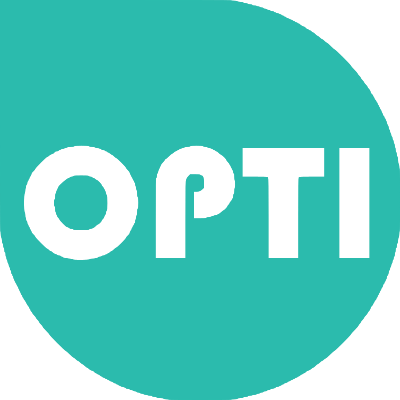

# Optidis



## What is Optidis ?

Optidis is a cost optimization project for trainings.
If your company nneds to train a lot of its workers scattered in agencies in some possible training centers, this project is for you.
This project permits to generate an 'ideal' solution to this problem.

Costs are the following :
* 3 000 € per opened training center
* 0.40 € per people (* 2 for a two-way trip)


## Demo

The website is available [here](http://optidis.chbe.fr).
Just click on the Info/Demo button and follow the explanation.

In the limited version (without a valid key), the generation is limited to 10 agencies and 50 training centers (and 15 iterations for the tabou algorythm).


## How to run it locally ?

Just follow these steps :
* Clone the project to the `htdocs/` folder of your apache
* Create at the root of the project the `params.inc.php` file with this content :
``` php
 <?php
 
 $keys = array(
  "apikey"
 );
``` 
* Modify the host variable of the `stylescript.js` (on the top of the file) to match `localhost` (change https to http accordingly)
* Launch the apache service
* Open a new tab and navigate to `http://localhost/optidis`
* Deploy the left menu, then enter the key 'apikey'
* You can now use all functionalities of the website !
